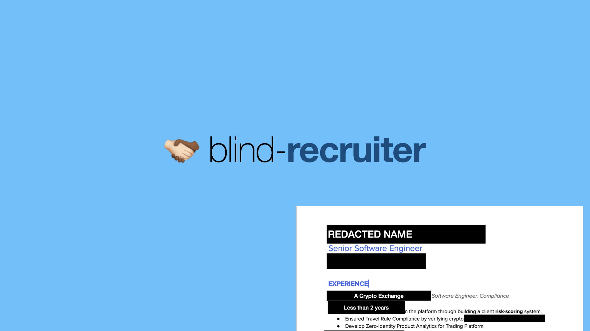
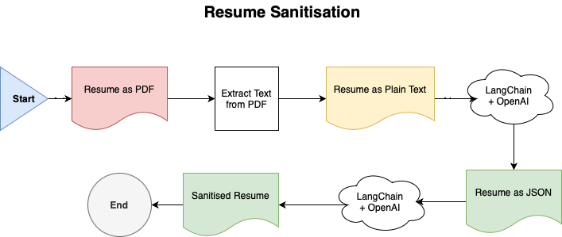

# blind-recruiter
Remove human bias from the resume screening process

## Introduction
Humans are inherently biased, and when choosing resumes, biases may prevent eligible candidates from
even making a first impression. Check out a [nifty list of biases](https://github.com/aniruddha-adhikary/blind-recruiter/wiki/Biases-to-address).

## How it (is supposed to) work

TODO: Describe the image for users using a screen reader.